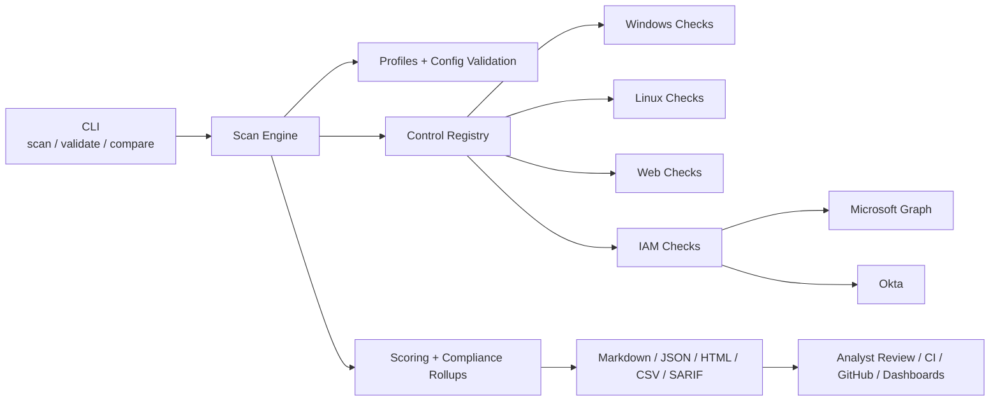
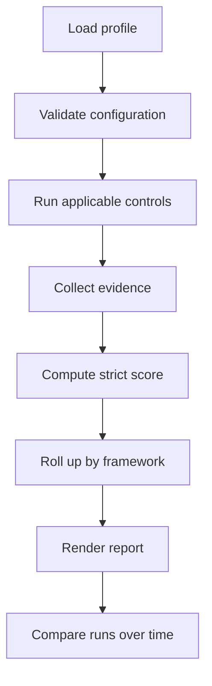

# controlguard

Automated security control validation lab for Windows, Linux, web, Microsoft Entra, and Okta.

`controlguard` verifies security controls on hosts, web targets, and identity platforms, then turns the result into structured audit evidence for analysts, CI/CD pipelines, and hardening workflows.

## Architecture



## Workflow



## Quick audit snapshot

| Metric | Example |
| --- | --- |
| Global score | `61.5%` |
| Posture | `weak` |
| Blocking controls | `windows-defender-running`, `security-headers` |
| Applicable controls | `4/4` |
| Output formats | `HTML`, `JSON`, `CSV`, `SARIF`, `Markdown` |

## Sample status distribution

| Status | Count | Visual |
| --- | --- | --- |
| `pass` | `2` | `##########` |
| `fail` | `2` | `##########` |
| `warn` | `0` | `-` |
| `error` | `0` | `-` |
| `evidence_missing` | `0` | `-` |
| `not_applicable` | `0` | `-` |

## Sample framework summary

| Framework | Score | Compliant |
| --- | --- | --- |
| `CIS Controls v8` | `70.0%` | `false` |
| `NIST CSF 2.0` | `50.0%` | `false` |
| `OWASP` | `0.0%` | `false` |

## Live examples in the repo

- [sample-report.html](docs/samples/sample-report.html)
- [sample-report.json](docs/samples/sample-report.json)
- [sample-report.sarif](docs/samples/sample-report.sarif)
- [sample-compare.html](docs/samples/sample-compare.html)

## Why this project

The project targets four concrete use cases:

- audit: each control returns a status, evidence, evidence source, and remediation
- compliance: controls can be rolled up into `CIS`, `NIST CSF`, `ISO 27001`, and `OWASP`
- hardening: the engine points directly to actionable security gaps
- automation: scans return stable exit codes and machine-friendly outputs

## What the engine already does

- strict weighted scoring
- explicit separation between `fail`, `error`, `not_applicable`, and `evidence_missing`
- required controls that block compliance
- framework summaries
- built-in profiles
- deterministic report comparison
- Markdown, JSON, HTML, CSV, and SARIF outputs

## What makes this strict

- `not_applicable` is excluded from score instead of acting like an implicit pass
- `evidence_missing` gives zero credit
- a required blocking control makes the scan non-compliant
- framework rollups reuse the same strict scoring rules as the global score

## Covered controls

- Windows Firewall enabled
- Windows Event Log running
- Microsoft Defender running
- UAC enabled
- PowerShell Script Block Logging enabled
- RDP disabled
- SMBv1 disabled
- Secure Boot enabled
- sensitive ports exposure
- BitLocker system drive encryption
- web security headers
- broad permissions on target paths
- admin MFA via Microsoft Graph
- admin MFA via Okta
- Linux firewall
- Linux auditd
- Linux SSH password authentication

## Installation

```powershell
python -m venv .venv
.\.venv\Scripts\Activate.ps1
pip install -e .
```

For development tooling:

```powershell
pip install -e .[dev]
```

## Built-in profiles

- `lab`: end-to-end demonstration profile
- `windows-workstation`: Windows hardening baseline
- `linux-server`: Linux hardening baseline
- `web-application`: web security headers profile
- `entra-admin-mfa`: Microsoft Graph admin MFA
- `okta-admin-mfa`: Okta admin MFA

## Documentation

- [Architecture](docs/ARCHITECTURE.md)
- [Roadmap](ROADMAP.md)
- [Release notes v0.1.0](docs/RELEASE_NOTES_v0.1.0.md)
- [Live validation playbook](docs/LIVE_VALIDATION_PLAYBOOK.md)
- [Contributing](CONTRIBUTING.md)

## Useful commands

Run the main profile:

```bash
controlguard scan --profile lab
```

Validate only a profile:

```bash
controlguard validate --profile windows-workstation
```

Export an HTML report:

```bash
controlguard scan --profile windows-workstation --format html --output reports/windows.html
```

Export only findings as SARIF:

```bash
controlguard scan --profile lab --only-failed --format sarif --output reports/lab.sarif
```

Compare two JSON scan reports:

```bash
controlguard compare --baseline reports/baseline.json --current reports/current.json --format markdown
```

## Included examples

- [sample-report.json](docs/samples/sample-report.json)
- [sample-report.html](docs/samples/sample-report.html)
- [sample-report.sarif](docs/samples/sample-report.sarif)
- [sample-compare.md](docs/samples/sample-compare.md)
- [sample-compare.html](docs/samples/sample-compare.html)

## Microsoft Graph configuration

The `microsoft_graph_admin_mfa` control uses `userRegistrationDetails` to verify active admin accounts.

Expected environment variables:

```powershell
$env:CONTROLGUARD_GRAPH_TENANT_ID="your-tenant-id"
$env:CONTROLGUARD_GRAPH_CLIENT_ID="your-app-client-id"
$env:CONTROLGUARD_GRAPH_CLIENT_SECRET="your-app-client-secret"
controlguard scan --profile entra-admin-mfa --format markdown
```

Prerequisites:

- `AuditLog.Read.All` application permission
- admin consent
- Microsoft Entra ID P1 or P2 licensing for authentication methods reporting

## Okta configuration

The `okta_admin_mfa` control lists admin users and verifies that each one has at least one strong enrolled MFA factor.

Example with a pre-acquired access token:

```powershell
$env:CONTROLGUARD_OKTA_ACCESS_TOKEN="your-okta-access-token"
controlguard scan --profile okta-admin-mfa --format markdown
```

Recommended prerequisites:

- scopes such as `okta.roles.read` and `okta.users.read`
- or an `SSWS` API token if you use that mode
- strong factor defaults: `push`, `signed_nonce`, `webauthn`, `u2f`, `token:software:totp`, `token:hardware`

## Exit codes

- `0`: no blocking finding
- `1`: `fail`, `error`, or `evidence_missing`
- `1` also with `--fail-on-warn` if a `warn` exists
- `1` also with `--strict` if any finding exists
- `2`: configuration, loading, or comparison error

## Output formats

- `markdown`: fast human reading
- `json`: automation and post-processing
- `html`: executive summary plus technical details
- `csv`: tabular export
- `sarif`: security tooling and code-scanning integration

## What the HTML report shows

- global score ring
- visual status distribution
- visual severity distribution
- framework cards
- blocker view
- findings table plus expandable technical detail

## Validated today

Validated in this repository:

- unit test suite
- multi-profile validation
- deterministic sample report generation
- quality tooling configuration for CI

Still pending live proof:

- Microsoft Graph validation on a real tenant
- Okta validation on a real tenant

## Threat model and limits

- the tool validates declared controls, not the entire security posture of an environment
- a `pass` means evidence was observed for that control, not that the system is fully secure
- connector quality also depends on the permissions and APIs available in the target environment
- this is an advanced lab, not yet a full SOC platform

## Next steps

- live Microsoft Graph validation
- live Okta validation
- AWS / Azure / GCP posture connectors
- more Linux and TLS controls
- historical scan dashboards
